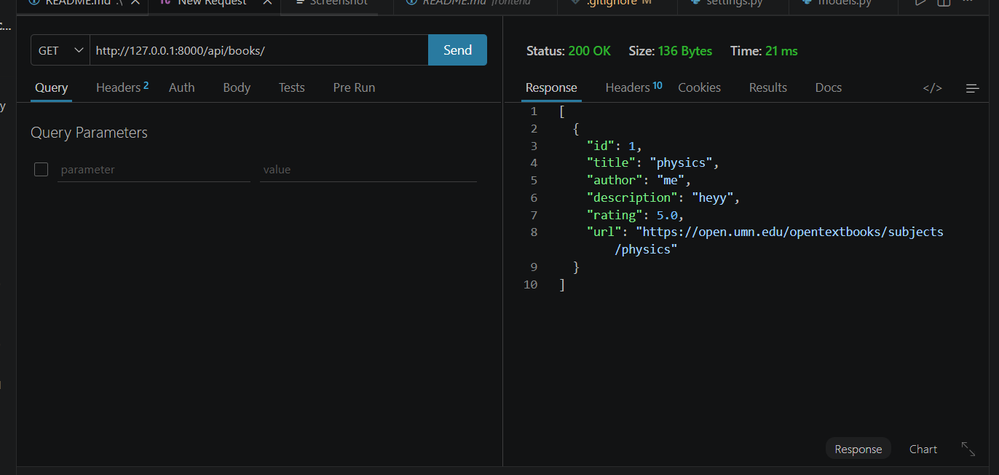
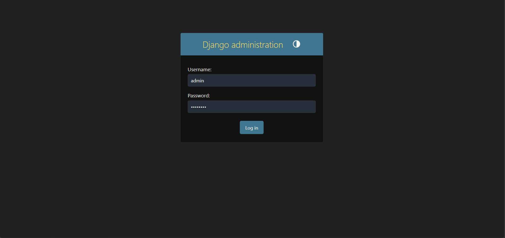

# Document Intelligence Platform (AI + RAG)

##  Overview

This project is a full-stack AI-powered web application that processes book data and enables intelligent querying using a Retrieval-Augmented Generation (RAG) pipeline.

The system allows users to:

* Scrape and store book data
* Generate AI-based insights
* Ask questions about books
* Get contextual answers using RAG


## Features

### Backend (Django REST Framework)

* REST APIs for book management
* Book scraping using Selenium
* AI insights:

  * Summary generation
  * Genre classification
  * Book recommendations
* RAG-based Question Answering system

### Frontend (ReactJS)

* User-friendly interface
* Ask questions about books
* Display AI-generated answers


## Tech Stack

| Layer      | Technology                          |
| ---------- | ----------------------------------- |
| Backend    | Django, Django REST Framework       |
| Frontend   | ReactJS                             |
| Database   | SQLite (can be replaced with MySQL) |
| Vector DB  | FAISS                               |
| AI         | Sentence Transformers               |
| Automation | Selenium                            |


## API Endpoints

### Books

* `GET /api/books/` → List all books
* `GET /api/books/<id>/` → Book details
* `POST /api/books/create/` → Add book

### AI Insights

* `GET /api/books/<id>/insights/` → Summary, Genre, Recommendations

### Scraper

* `POST /api/scrape/` → Scrape and store books

### RAG

* `POST /api/ask/` → Ask questions about books


## Sample Request

```json
POST /api/ask/

{
  "question": "What is this book about?"
}
```
## Setup Instructions

### Backend

```bash
cd backend
python -m venv venv
venv\Scripts\activate
pip install -r requirements.txt
python manage.py migrate
python manage.py runserver
```

### Frontend

```bash
cd frontend
npm install
npm start
```

## screenshots

### 🔹 frontend UI


### 🔹 api testing (Thunder Client)


### 🔹 admin panel


* Dashboard page
* Q&A interface
* Book details page

## How it Works (RAG Pipeline)

1. User asks a question
2. Question converted into embeddings
3. Similar book content retrieved using FAISS
4. Context passed to generator
5. Answer generated and returned

## Bonus Features

* Basic AI pipeline implementation
* Modular architecture
* Full-stack integration


## Future Improvements

* Use OpenAI / LM Studio for better answers
* Add authentication
* Improve UI with Tailwind CSS
* Store chat history


## Author

Priya


## Submission

GitHub Repository:(https://github.com/priyamaan924/Document-Intelligence-Platform)

